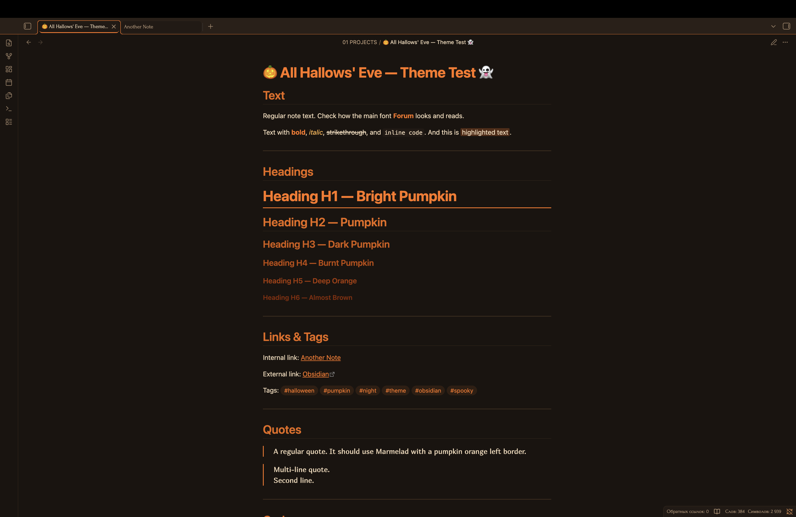
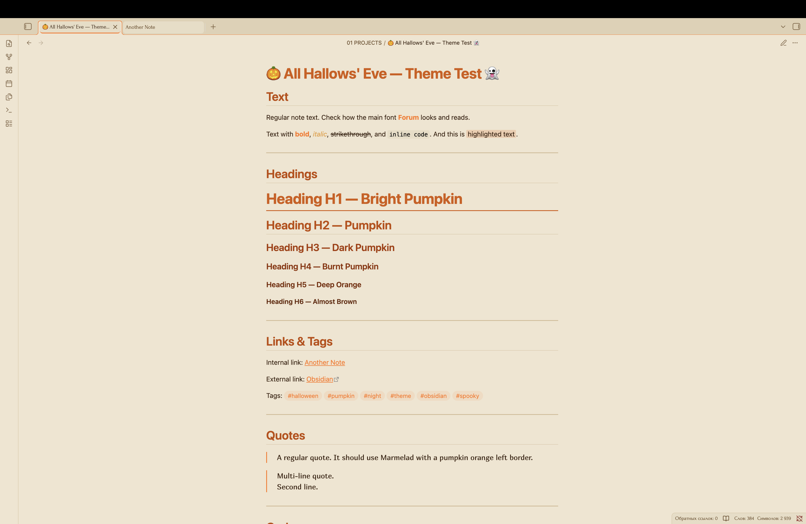

# 🎃 All Hallows' Eve — тема для Obsidian

Хэллоуинская тема для Obsidian. Тыквенный оранжевый, свечное свечение и жуткая элегантность. Тёмная и светлая темы. Для тех, кто хочет, чтобы заметки ощущались как ночь с призраками 👻

---

## 📑 Оглавление

- [✨ Особенности](#features)
- [📸 Скриншоты](#screenshots)
- [📦 Установка](#installation)
- [🎨 Цветовая палитра](#color-palette)
- [🛠️ Настройка](#customization)
- [💡 Поделись идеей](#ideas)
- [✨ Дополнительные эффекты](#effects)
- [📝 Благодарности](#credits)

---

<a id="features"></a>

## ✨ Особенности

- 🎃 Тыквенная оранжевая палитра со свечными акцентами
- 🌅 Градиент заголовков — от яркой тыквы к тёмному угольку
- 🌓 Поддержка тёмной и светлой темы
- 📜 Готическая типографика: Forum, Ruslan Display, Marmelad, JetBrains Mono
- 🎯 Контрастность соответствует WCAG для доступности
- ✨ Высококонтрастная подсветка синтаксиса кода
- 🖊️ Плавные анимации и переходы
- 🎃 Тыквенные разделители с тремя тыквами по центру

---

<a id="screenshots"></a>

## 📸 Скриншоты

### Тёмная тема



### Светлая тема



---

<a id="installation"></a>

## 📦 Установка

### Из магазина тем Obsidian

1. Открой настройки Obsidian
2. Перейди в **Оформление** → **Темы** → **Управление**
3. Найди All Hallows Eve в магазине сообщества
4. Нажми **Установить**, затем **Применить**

> **Примечание:** Тема отправлена на проверку в магазин тем Obsidian и ожидает модерации. 🎃

### Ручная установка

1. Скачай файлы `theme.css` и `manifest.json`
2. Создай папку `All Hallows Eve` в каталоге `.obsidian/themes/`
3. Помести туда оба файла
4. Включи тему в настройках Obsidian: **Оформление** → **Темы**

---

<a id="color-palette"></a>

## 🎨 Цветовая палитра

### Градиент заголовков

| Заголовок | Тёмная тема | Светлая тема | Настроение       |
| --------- | ----------- | ------------ | ---------------- |
| H1        | `#ff7518`   | `#b84a08`    | Яркая тыква      |
| H2        | `#e86810`   | `#a83a00`    | Тыква            |
| H3        | `#d45a08`   | `#903000`    | Тёмная тыква     |
| H4        | `#c04a00`   | `#782800`    | Жжёная тыква     |
| H5        | `#a83a00`   | `#602000`    | Глубокий оранж   |
| H6        | `#8a2a00`   | `#481800`    | Почти коричневый |

### Основные цвета

| Элемент | Тёмная тема | Светлая тема |
| ------- | ----------- | ------------ |
| Фон     | `#1a1410`   | `#e4d8c0`    |
| Текст   | `#f0d8b8`   | `#2e1a08`    |
| Акцент  | `#ff7518`   | `#b84a08`    |
| Свеча   | `#ffb347`   | `#c9853a`    |

---

<a id="customization"></a>

## 🛠️ Настройка

### Изменение цветов

Ты можешь изменить цвета, отредактировав CSS-переменные в файле `theme.css`:

```css
--halloween-pumpkin: #ff7518; /* Измени на свою тыкву */
--halloween-pumpkin-dark: #d45a08; /* Измени на свою тёмную тыкву */
--halloween-candle: #ffb347; /* Измени на своё свечение свечи */
```

### Рекомендуемый акцентный цвет

Для наилучшего восприятия установи в Obsidian акцентный цвет:

- **RGB:** `255, 117, 24`
- **HEX:** `#ff7518`

> **Примечание:** Тема жёстко задаёт акцентные цвета, поэтому настройки пользователя будут переопределены.

---

<a id="ideas"></a>

## 💡 Поделись идеей

Есть идея для новой функции или жуткой детали, которую хотелось бы видеть в All Hallows' Eve? Буду рад услышать!

Ты можешь поделиться предложением через:

- 🐛 [Создать issue на GitHub](https://github.com/RamenOfficialGovPatsy/All-Hallows-Eve/issues)
- ✉️ Написать сообщение на [форуме Obsidian](https://forum.obsidian.md)

Твои идеи помогают сделать тему ещё жутче для всех! 🎃👻

---

<a id="effects"></a>

## ✨ Дополнительные эффекты

Эффекты, которые можно добавить в тему. Отмеченные пункты уже реализованы.

- [x] 🎃 **Тыквенные разделители** — градиент с тремя тыквами по центру
- [ ] 🎃 **Иконки в сворачиваемых блоках** — 🎃 (свёрнуто) / 👻 (развёрнуто)
- [ ] 🕸️ **Паутина на границах** — лёгкий узор паутины на границах
- [ ] 🕯️ **Мерцание свечи** — пульсирующее свечение активных вкладок
- [ ] 👻 **Призрачное появление** — плавное появление заметок с лёгким смещением
- [ ] 🦇 **Летучая мышь на курсоре** — иконка летучей мыши вместо курсора
- [ ] 🍬 **Цветные теги** — разные цвета для разных типов тегов
- [ ] 🌕 **Луна в углу** — полупрозрачная луна в правом верхнем углу
- [ ] 💀 **Черепа вместо маркеров** — кастомные маркеры списка

---

<a id="credits"></a>

## 📝 Благодарности

- Вдохновлена хэллоуинскими ночами, тыквенными фонарями и светом свечей
- Типографика: Forum, Ruslan Display, Marmelad, JetBrains Mono
- Создана для жуткой, атмосферной и комфортной работы с заметками

---

**Наслаждайся жуткой атмосферой All Hallows' Eve! 🎃👻**
